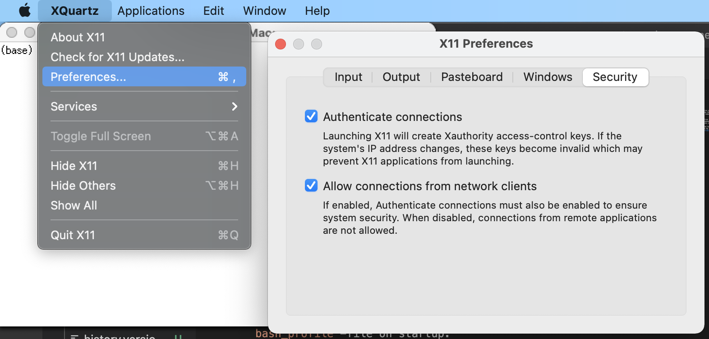

# Setup for macOS

## Docker

For the containers to work properly it is needed to give docker permissions to share the user directory with the containers. This can be done by adding the `/Users/<your_user>` in the list of shared directories. This list can be found under Docker -> Preferences -> Resources -> FILE SHARING.

## X11 with xquartz
Xquartz is the open source macOS version of the X Window System and it is required to display windows that are running inside a container (f.e. omnetpp-ide). 

It can be installed with homebrew via `brew install --cask xquartz`. Once installed, the xquartz application can be started via spotlight and a new console can be opened via `command + n`.

Unfortunately the these consoles does not read the `.bash_profile` on startup. 
For easier usability it's recommended to add the crownet environment variables to the console by typing `source <path_to_project>/scripts/crownetenv`.

Furthermore under xquartz -> Preferences -> Security, the "Allow connections from network clients" checkbox must be enabled.



Inside the xquartz console you can run a gui-container and the window should appear.

## Container debugging

Currently it's not possible to execute sudo commands inside a container on macOS, because the user is unknown inside the container. A possible workaround is to create a new user inside the container based on your current user details.

Inside the Dockerfile add following code:
```
ARG USER_ID
RUN adduser --disabled-password --uid $USER_ID user
RUN usermod -aG sudo user
RUN passwd -d user
```
Then build the container with the `USER_ID`-Argument set to $(id -u).
```
# example for omnetpp-ide
docker build -t sam-dev.cs.hm.edu:5023/rover/crownet/omnetpp-ide --build-arg USER_ID=$(id -u) .
```

